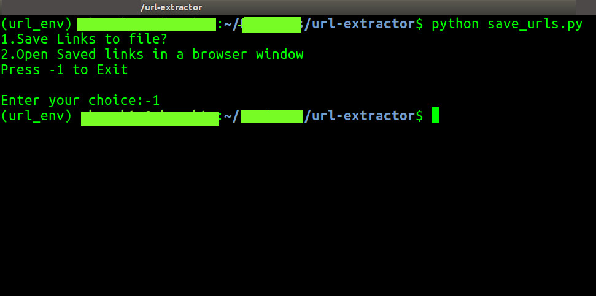

# SaveURL

 
## Table of contents
* [Description](#description)
* [Dependencies](#dependencies)
* [Setup](#setup)
* [Run this project](#run-this-project)
* [Features](#features)
* [To Do](#to-do)
* [Feature Requests](#feature-requests)
* [Contribute to this Project](#contribute-to-this-project)
* [Contributors](#contributors)
<!--* [Contact](#contact)-->
* [License](#license)

## Description
A simple Python script to save URLS of all open tabs across multiple windows in a single text file.
	
## Dependencies
Project is created with:
* Python version: 3.6.8
* Pathlib library
* lz4  
	
## Setup
If the above depedencies are already install on your system, skip to [Run this project](#run-this-project).  
If not installed, proceed with the installation steps below.

### Installations

#### Install the requirements on a virtual environment
Follow the instructions in [this Github gist](https://gist.github.com/frfahim/73c0fad6350332cef7a653bcd762f08d) for your system. 

Or do as follows:
#### Install pip
$`sudo apt-get install python3-pip`

#### Install virtualenv 
$`sudo pip3 install virtualenv 
`
#### Create a virtual environment
$`virtualenv -p python3.6 url_env `

Once `virtualenv` is installed, activate it using   
$`source url_env/bin/activate`

#### Install pathlib module
$`pip install pathlib`

#### Installing lz4
$`pip install lz4`

## Run this project
To run this project, fork and clone this repository. *(Donot forget to star this repository if you like the project :P)*  

Execute this script from the terminal/command line using  
`$ python save_urls.py`  

You will be prompted for the following: 
- Save Links to a file
- Open saved files on a Browser Window

Enter your choice.

<!--- Add screenshots for various functions so that it's clear what has been done. ---> 

## Features
* Provision for automatic saving of all URLs hassle-free
* Opens saved URLs in a specified file on the browser tab

## To Do ##
- Add GUI, if possible
- Add screenshots/GIFs of the working

## Feature Requests ##
Please open an issue titled '[Feature Request]' and provide as much details as possible for what you'd like as a feature.  
Any suggestions to make this project better is welcomed! :)

## Contribute to this Project
To contribute to this Project, follow these steps:
- Fork this repository.
- Create a branch: `$ git checkout -b <branch_name>`
- Make your changes and commit them: `$ git commit -m <commit_message>`
- Push to the original branch: `$ git push origin <project_name>/<location>`
- Create the pull request

Alternatively see the GitHub documentation on [creating a pull request](https://help.github.com/en/github/collaborating-with-issues-and-pull-requests/creating-a-pull-request).

## Contributors
This project is developed and maintained by [@dvlpsh](https://github.com/dvlpsh).

<!--## Contact
Reach me at my email: [dvlpsh21@gmail.com](mailto:dvlpsh21@gmail.com).-->

## License
This project uses the [MIT LICENSE](LICENSE).
